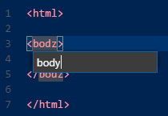

# Rename HTML/XML tags
Rename HTML/XML tags extension for Visual Studio Code.

After installing, open a HTML, XML or PHP file, place the cursor on a &lt;start&gt; or &lt;/end&gt; tag and press `F2` (`Rename Symbol`).

Note: `Rename Symbol` is available also on attribute names, values...on anything that looks like an id. This extension handles only tag names.

## Release Info

v0.2.1
- Renames tags in PHP files.

v0.1.1
- Handles self-closing elements and HTML void elements like `input`, `br`, `link` etc.

v0.1.0
- Initial release

## Development setup
- run `npm install` inside the project folder
- open VS Code on the project folder

## Build
- run `npm run compile`

## Package
- run `vsce package`

